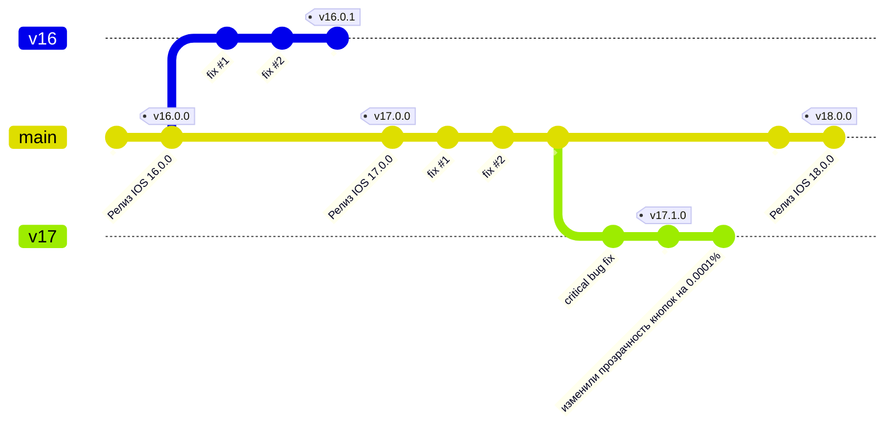

# Зачем нужны ветки в Git ?
Причина 3: Релизные ветки

```mermaid
%%{init: { 'gitGraph': {'mainBranchOrder': 1}} }%%
    gitGraph LR:
       commit id: " "
       commit id: "Релиз IOS 16.0.0" tag: "v16.0.0"
       branch v16 order: 0
       commit id: "fix #1"
       commit id: "fix #2"
       commit id: "  " tag: "v16.0.1"
       checkout main
       commit id: "Релиз IOS 17.0.0" tag: "v17.0.0"
       commit id: "fix #1"
       commit id: "fix #2"
       commit id: "      "
       branch v17 order: 2
       commit id: "critical bug fix"
       commit id: "    " tag: "v17.1.0"
       commit id: "изменили прозрачность кнопок на 0.0001%"
       checkout main
       commit id: "       "
       commit id: "Релиз IOS 18.0.0" tag: "v18.0.0"
```
