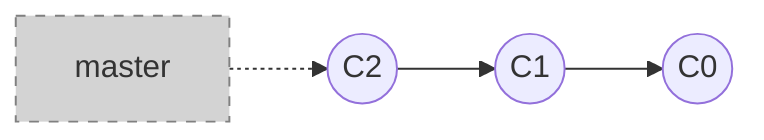

# Шаг 1. Создаем репозиторий
```shell
git init
git commit -m "C1"
git commit -m "C2"
```



<style>
.host {
    display: flex;
    flex-direction: column;
}

.mermaid {
    margin: auto;
}
</style>
