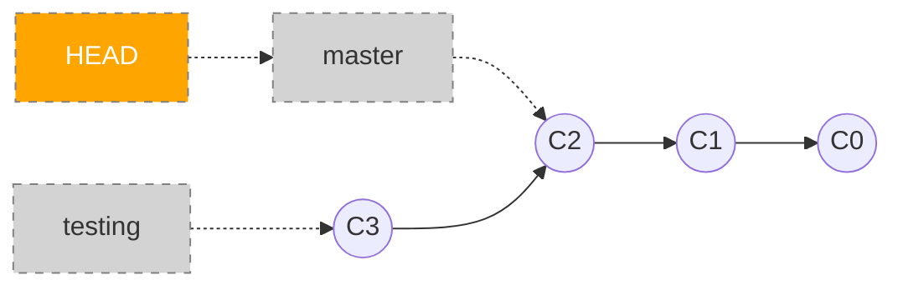

# Шаг 6. Переключаемся обратно на ветку master

```shell
git switch master
```


```mermaid {scale: 1.5}
%%{init: {"flowchart": {"htmlLabels": false}} }%%
flowchart LR
    commit0(("`C0`"))
    commit1(("`C1`"))
    commit2(("`C2`"))
    commit3(("`C3`"))
    master["master"]:::branch
    testing["testing"]:::branch
    head["HEAD"]:::head
    head -.-> master
    master -.-> commit2
    testing -.-> commit3
    commit3 --> commit2
    commit2 --> commit1
    commit1 --> commit0
    classDef branch fill:lightgray,stroke:gray,stroke-dasharray: 5 5
    classDef head fill:orange,color:white,stroke:gray,stroke-dasharray: 5 5
```

<style>
.host {
    display: flex;
    flex-direction: column;
}

.mermaid {
    margin: auto;
}
</style>
