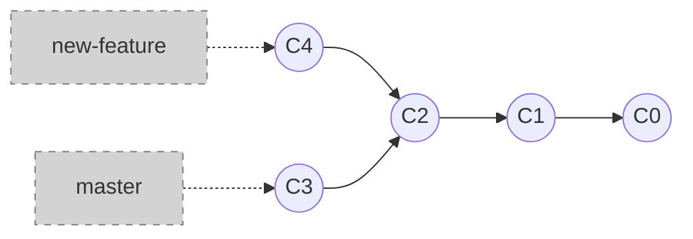

```mermaid {scale: 2}
%%{init: {"flowchart": {"htmlLabels": false}} }%%
flowchart LR
    commit0(("`C0`"))
    commit1(("`C1`"))
    commit2(("`C2`"))
    commit3(("`C3`"))
    commit4(("`C4`"))
    master["master"]:::branch
    feature["new-feature"]:::branch
    feature -.-> commit4
    master -.-> commit3
    commit4 --> commit2
    commit3 --> commit2
    commit2 --> commit1
    commit1 --> commit0
    classDef branch fill:lightgray,stroke:gray,stroke-dasharray: 5 5
```

