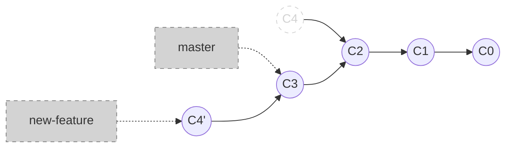

```shell
git switch new-feature
git rebase master
```



<style>
.host {
    display: flex;
    flex-direction: column;
}

.mermaid {
    margin: auto;
}

.host code {
    font-size: 2rem;
}
</style>
