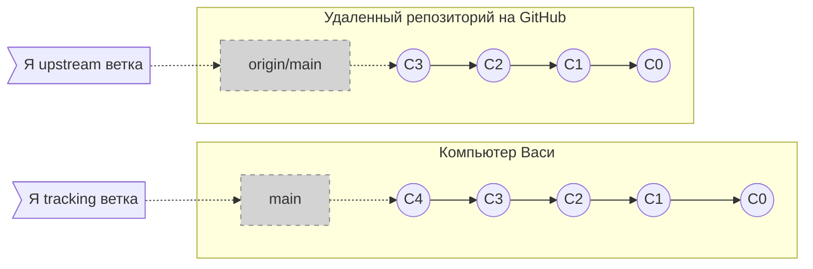

# Tracking и upstream ветки

 
 

```mermaid {scale: 1}
%%{init: {"flowchart": {"htmlLabels": false}} }%%
flowchart LR
    classDef branch fill:lightgray,stroke:gray,stroke-dasharray: 5 5
    classDef lost fill:none,color:lightgray,stroke:lightgray,stroke-dasharray: 5 5
    
    main["main"]:::branch
    commit0(("`C0`"))
    commit1(("`C1`"))
    commit2(("`C2`"))
    commit3(("`C3`"))
    commit4(("`C4`"))

    subgraph local [Компьютер Васи]
        direction LR
        main -.-> commit4
        commit4 --> commit3
        commit3 --> commit2
        commit2 --> commit1
        commit1 --> commit0
    end
    
    origin/main["origin/main"]:::branch
    C0(("`C0`"))
    C1(("`C1`"))
    C2(("`C2`"))
    C3(("`C3`"))
    
    subgraph remote [Удаленный репозиторий на GitHub]
        direction LR
        origin/main -.-> C3
        C3 --> C2
        C2 --> C1
        C1 --> C0
    end
    
    tracking>Я tracking ветка]
    upstream>Я upstream ветка]
    
    tracking -.-> main
    upstream -.-> origin/main
```
