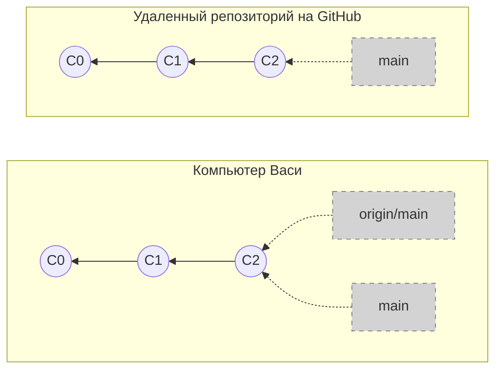

# Вытягиваем данным с удаленного репозитория
Время 12:00 | Исходные данные

 

```mermaid {scale: 1}
%%{init: {"flowchart": {"htmlLabels": false}} }%%
flowchart LR
    classDef branch fill:lightgray,stroke:gray,stroke-dasharray: 5 5
    
    main["main"]:::branch
    origin/main["origin/main"]:::branch
    commit0(("`C0`"))
    commit1(("`C1`"))
    commit2(("`C2`"))

    subgraph local [Компьютер Васи]
        direction RL
        origin/main -.-> commit2
        main -.-> commit2
        commit2 --> commit1
        commit1 --> commit0
    end
    
    remote-main["main"]:::branch
    C0(("`C0`"))
    C1(("`C1`"))
    C2(("`C2`"))
    
    subgraph remote [Удаленный репозиторий на GitHub]
        direction RL
        remote-main -.-> C2
        C2 --> C1
        C1 --> C0
    end
```

