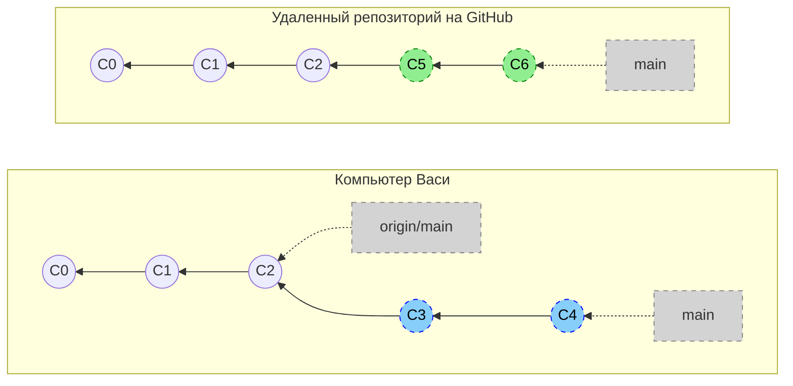

# Вытягиваем данным с удаленного репозитория
Время 14:28 | Коллега и вы насоздавали коммитов

 

```mermaid {scale: 1}
%%{init: {"flowchart": {"htmlLabels": false}} }%%
flowchart LR
    classDef branch fill:lightgray,stroke:gray,stroke-dasharray: 5 5
    classDef new-locals fill:lightskyblue,color:black,stroke:blue,stroke-dasharray: 5 5
    classDef new-remotes fill:lightgreen,color:black,stroke:green,stroke-dasharray: 5 5
    
    main["main"]:::branch
    origin/main["origin/main"]:::branch
    commit0(("`C0`"))
    commit1(("`C1`"))
    commit2(("`C2`"))
    commit3(("`C3`")):::new-locals
    commit4(("`C4`")):::new-locals

    subgraph local [Компьютер Васи]
        direction RL
        origin/main -.-> commit2
        main -.-> commit4
        commit4 --> commit3
        commit3 --> commit2
        commit2 --> commit1
        commit1 --> commit0
    end
    
    remote-main["main"]:::branch
    C0(("`C0`"))
    C1(("`C1`"))
    C2(("`C2`"))
    C5(("`C5`")):::new-remotes
    C6(("`C6`")):::new-remotes
    
    subgraph remote [Удаленный репозиторий на GitHub]
        direction RL
        remote-main -.-> C6
        C6 --> C5
        C5 --> C2
        C2 --> C1
        C1 --> C0
    end
```

